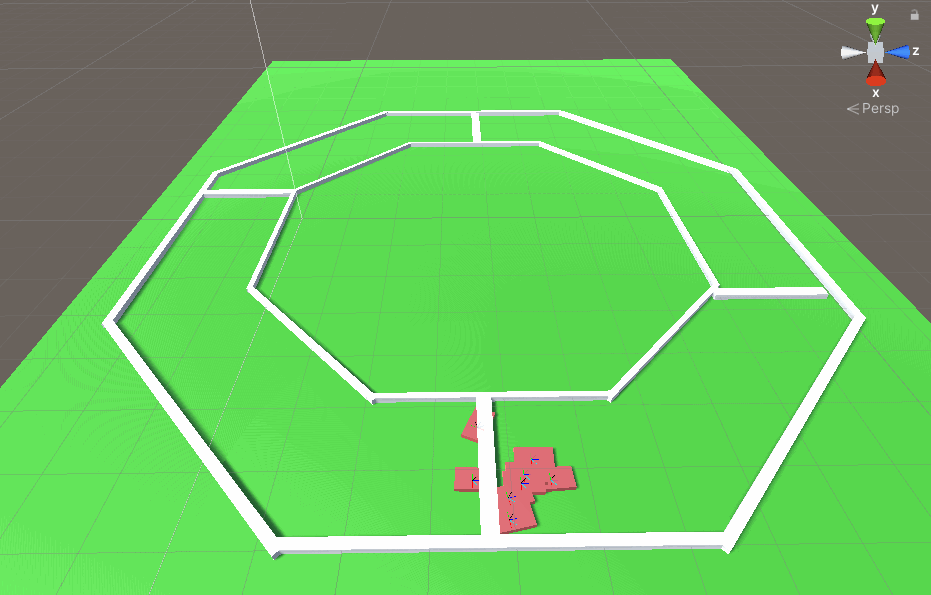

# Neural Car

---

I made this 5 years ago and I do not stand behind the quality of the code.

Nonetheless, I implemented the Neural Network from scratch without the use of any libraries.

#### Here's some cars that learned how to drive

Notice the white lines that the cars cross. These are "goals" that award some fitness to the cars for crossing them. The main purpose of this is to provide a concrete way to gauge success of each agent.
